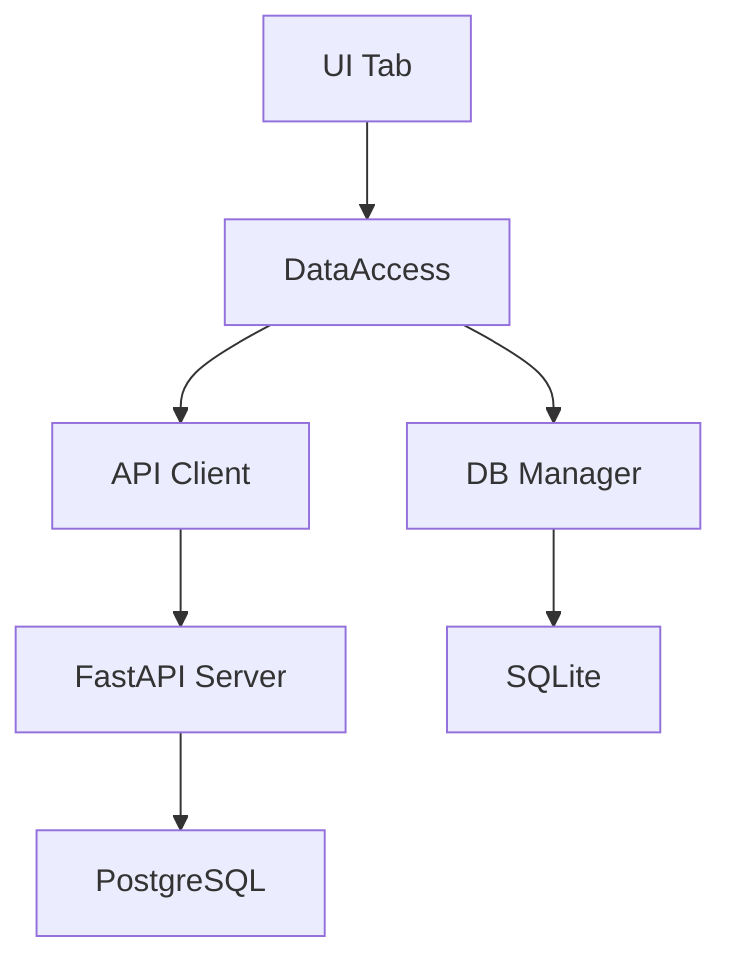

# Фаза Design — Архитектурное проектирование

> Фаза 2 из 6 в конвейере оркестрации. Выполняется Design Agent (opus).

## Назначение

Фаза Design — **проектирование решения ДО реализации**. На основе research.md агент создаёт архитектурный дизайн: C4 model, DFD, ADR, стратегию тестирования, API контракты.

## Когда выполняется

| Режим | Design |
|-------|--------|
| full | Полный |
| refactor | Полный |
| fix | Пропускается |
| test | Пропускается |
| security | Пропускается |
| deploy | Пропускается |
| docker | Пропускается |
| qa | Пропускается |

## Подход C4 Model

Иерархическая модель архитектуры от общего к частному:

### Level 1: Context
Самый высокий уровень — как система взаимодействует с внешним миром.

```
Кто/что взаимодействует с системой:
- Пользователи (дизайнер, администратор, директор)
- Внешние сервисы (Yandex.Disk, Email, Telegram)
- CI/CD (GitHub Actions)
```

### Level 2: Container
Технические контейнеры, из которых состоит система:

```
PyQt5 Desktop клиент (Windows)
    ↕ REST API (HTTPS)
FastAPI API сервер (Docker, Linux)
    ↕ SQL
PostgreSQL (Docker)

Клиент также:
    ↕ SQLite (локальная offline БД)
```

### Level 3: Component
Компоненты внутри каждого контейнера:

```
Клиент:
  ui/*.py → utils/data_access.py → utils/api_client.py
                                  → database/db_manager.py (fallback)

Сервер:
  server/main.py (роутеры) → server/database.py (SQLAlchemy)
                            → server/schemas.py (Pydantic)
```

### Level 4: Code
Классы, функции, сигнатуры — при сложной логике.

### Формат: Mermaid



## DFD — Data Flow Diagram

Описание потоков данных через компоненты системы.

### Формат

Для каждой задачи описывается:

1. **До изменений** — текущие потоки данных
2. **После изменений** — новые/изменённые потоки

### Пример

```
До:
  Пользователь → [UI: crm_tab] → [DataAccess] → [API Client] → [Server: GET /api/cards]
                                                → [DB Manager: get_crm_cards()] (fallback)

После:
  Пользователь → [UI: crm_tab] → [DataAccess] → [API Client] → [Server: GET /api/cards?filter=X]
                                                → [DB Manager: get_crm_cards(filter=X)] (fallback)
  Новый поток:
  Пользователь → [UI: filter_dialog] → [DataAccess] → ...
```

### Точки трансформации

Важно отметить где данные трансформируются:
- **API Client → Server:** сериализация в JSON
- **Server → PostgreSQL:** SQLAlchemy ORM
- **DataAccess → DB Manager:** прямой SQL
- **UI → DataAccess:** Python объекты

## ADR — Architecture Decision Records

### Когда создавать

ADR создаётся если:
- Принимается решение, **отличное** от текущих паттернов проекта
- Добавляется **новая зависимость** (библиотека, сервис)
- Меняется **формат данных** или контракт
- Выбирается подход из **нескольких альтернатив**

### Формат

```markdown
### ADR-{N}: {Название решения}

**Контекст:**
Почему нужно принять решение. Какая проблема решается.

**Решение:**
Что выбрано и как будет реализовано.

**Альтернативы:**
1. {Альтернатива 1} — {почему отклонена}
2. {Альтернатива 2} — {почему отклонена}

**Последствия:**
- Плюсы: {что улучшится}
- Минусы: {какие trade-offs}
- Влияние: {на какие модули повлияет}
```

### Пример

```markdown
### ADR-1: Хранение фильтров на клиенте

**Контекст:**
Нужно сохранять пользовательские фильтры CRM карточек между сессиями.

**Решение:**
Хранить в SQLite таблице `user_preferences` с JSON полем.

**Альтернативы:**
1. LocalStorage (QSettings) — нет offline-синхронизации
2. Серверный API — зависимость от сети для настроек

**Последствия:**
- Плюсы: работает offline, синхронизируется при подключении
- Минусы: дополнительная миграция SQLite
- Влияние: db_manager.py, data_access.py
```

## Стратегия тестирования

### Типы тестов

| Тип | Что тестируем | Где |
|-----|--------------|-----|
| **Unit** | Отдельные функции/методы | tests/client/, tests/api_client/ |
| **Integration** | Связки компонентов | tests/db/, tests/backend/ |
| **E2E** | Полные сценарии (API→DB) | tests/e2e/ |
| **UI** | Виджеты, диалоги, клики | tests/ui/ |

### Для каждого типа определить

```markdown
### Unit тесты
- Что: {конкретные функции/методы}
- Кейсы: {позитивные, негативные, пограничные}
- Моки: {что мокается}

### Integration тесты
- Связки: {API Client → Server, DataAccess → DB}
- Сценарии: {online, offline, переключение}

### E2E тесты
- Сценарии: {полные пользовательские потоки}
- Роли: {какие роли задействованы}

### UI тесты
- Виджеты: {какие компоненты}
- Взаимодействия: {клик, ввод, навигация}

### Acceptance criteria
- {Условие 1}: {как проверить}
- {Условие 2}: {как проверить}
```

### Двухрежимность

**Обязательно** покрывать тестами оба режима:
- Online: API работает → данные через Server
- Offline: API недоступен → данные через SQLite fallback

## API контракты

### Когда создавать

Создаются если задача затрагивает `server/` файлы.

### Формат

```markdown
## Endpoints

| Метод | Путь | Request Body | Response | HTTP коды | Описание |
|-------|------|-------------|----------|-----------|----------|
| GET | /api/entities | — | [{...}] | 200, 401 | Список |
| GET | /api/entities/{id} | — | {...} | 200, 404 | Одна запись |
| POST | /api/entities | EntityCreate | EntityResponse | 201, 422 | Создание |
| PUT | /api/entities/{id} | EntityUpdate | EntityResponse | 200, 404 | Обновление |
| DELETE | /api/entities/{id} | — | {"message": "ok"} | 200, 404 | Удаление |

## Pydantic схемы

class EntityBase(BaseModel):
    field1: str
    field2: Optional[int] = None

class EntityCreate(EntityBase): pass

class EntityUpdate(BaseModel):
    field1: Optional[str] = None

class EntityResponse(EntityBase):
    id: int
    created_at: datetime
    class Config:
        from_attributes = True
```

### Правила совместимости

1. **Статические endpoints ПЕРЕД динамическими** в server/main.py
2. **Ключи ответов** совпадают между Server и DB Manager
3. **DataAccess обёртки** покрывают все новые методы
4. **Offline fallback** возвращает идентичный формат

## Выходной артефакт

Файл: `docs/plan/{task-slug}/design.md`

### Шаблон

```markdown
# Дизайн: {название задачи}
Дата: {дата}
Основа: [research.md](research.md)

## C4 Model

### Context
{Внешние системы и пользователи}

### Container
{Затронутые контейнеры}

### Component
{Компоненты — Mermaid диаграмма}

## DFD

### До изменений
{Текущие потоки данных}

### После изменений
{Новые потоки данных}

## ADR (если применимо)
{Архитектурные решения — или "Не требуется"}

## Стратегия тестирования
{Unit / Integration / E2E / UI + acceptance criteria}

## API контракты (если server/)
{Endpoints + Pydantic схемы}
```

## Связь с другими фазами

```
Research (фаза 1) → research.md
    │
    ▼
Design (фаза 2) → design.md ← ВЫ ЗДЕСЬ
    │
    ▼
Plan (фаза 3) — использует design.md для:
  - Определения подзадач по C4 components
  - Маппинга тестов из стратегии
  - Формирования API контрактов для субагентов
    │
    ▼
Implement (фаза 4) — субагенты сверяются с design.md
Gate Checker — проверяет соответствие design.md
```

## Агент

- **Файл:** `.claude/agents/design-agent.md`
- **Модель:** opus
- **Инструменты:** Grep/Glob, Read, Write, SequentialThinking
