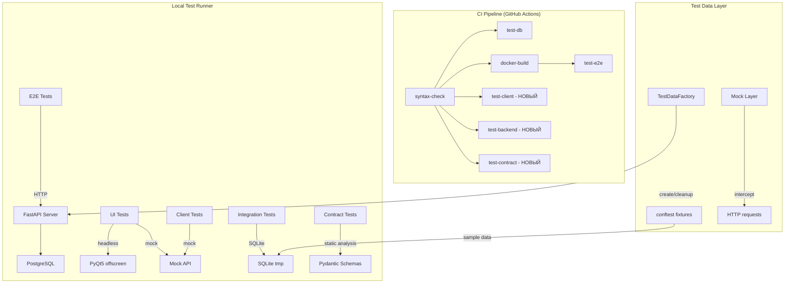

# Дизайн: Тестовое покрытие 90-95% (test-coverage-90)
Дата: 2026-02-26
Основа: [research.md](research.md)

---

## 1. C4 Model

### 1.1 Context — Внешние системы и акторы

```
+-------------------+       +-------------------+       +-------------------+
|    Разработчик    |       |   GitHub Actions   |       |   Production      |
|  (local pytest)   |       |   (CI Pipeline)    |       |   Server          |
+--------+----------+       +--------+----------+       +--------+----------+
         |                           |                           |
         v                           v                           v
+------------------------------------------------------------------------+
|                    ТЕСТОВАЯ ИНФРАСТРУКТУРА CRM                          |
|  12 категорий тестов | 93 файла | ~2032 тестов                          |
+------------------------------------------------------------------------+
         |                           |                           |
         v                           v                           v
+-------------------+       +-------------------+       +-------------------+
|   SQLite (tmp)    |       | PostgreSQL (CI)    |       |  PyQt5 (headless) |
+-------------------+       +-------------------+       +-------------------+
```

### 1.2 Container — Контейнеры тестовой инфраструктуры

```
+========================================================================+
|                        ТЕСТОВАЯ ИНФРАСТРУКТУРА                          |
|                                                                         |
|  +---------------------------+    +---------------------------+         |
|  |   CI Pipeline (GitHub)    |    |   Local Test Runner       |         |
|  |   - syntax-check          |    |   - pytest (все категории)|         |
|  |   - lint (flake8)         |    |   - QT_QPA_PLATFORM=      |         |
|  |   - test-db (SQLite)      |    |     offscreen             |         |
|  |   - docker-build          |    |   - coverage report       |         |
|  |   - test-e2e (PostgreSQL) |    |                           |         |
|  +---------------------------+    +---------------------------+         |
|                                                                         |
|  +---------------------------+    +---------------------------+         |
|  |   Test Data Layer         |    |   Mock Layer              |         |
|  |   - TestDataFactory       |    |   - mock_api_client       |         |
|  |   - conftest фикстуры     |    |   - mock_data_access      |         |
|  |   - sample_* данные       |    |   - _block_real_db        |         |
|  |   - db_with_data          |    |   - _block_real_api       |         |
|  +---------------------------+    +---------------------------+         |
|                                                                         |
|  +---------------------------+    +---------------------------+         |
|  |   E2E Test Server         |    |   Contract Validation     |         |
|  |   - FastAPI + PostgreSQL  |    |   - Pydantic schemas      |         |
|  |   - uvicorn (CI)          |    |   - Response key checks   |         |
|  |   - admin:admin123 auth   |    |   - DB↔API compatibility  |         |
|  +---------------------------+    +---------------------------+         |
+=========================================================================+
```

### 1.3 Component — Компоненты внутри контейнеров

```
CI Pipeline
├── syntax-check         py_compile 5 серверных файлов
├── lint                 flake8 server/ (14 игнорируемых правил)
├── test-db              pytest tests/db/ (42 теста, SQLite)
├── docker-build         docker build ./server
├── test-e2e             pytest tests/e2e/ (368 тестов, PostgreSQL)
├── [НОВЫЙ] test-client  pytest tests/client/ (310 тестов, mock)
├── [НОВЫЙ] test-backend pytest tests/backend/ + tests/api_client/ (293 теста)
└── [НОВЫЙ] test-contract pytest tests/contract/ (contract тесты)

Local Test Runner
├── tests/e2e/           32 файла, реальный HTTP
├── tests/ui/            13 файлов, PyQt5 headless
├── tests/client/        11 файлов, unit/mock
├── tests/integration/   9 файлов, SQLite + mock API
├── tests/api_client/    4 файла, mock CRUD
├── tests/edge_cases/    10 файлов (требуют переписывания)
├── tests/backend/       4 файла, mock бэкенд
├── tests/frontend/      2 файла, mock PyQt5
├── tests/db/            4 файла, SQLite миграции
├── tests/smoke/         1 файл, API health
├── tests/regression/    1 файл, критические баги
└── [НОВЫЙ] tests/contract/  contract тесты API↔DB ключей

Test Data Layer
├── tests/conftest.py           Корневые фикстуры (temp_db, sample_*)
├── tests/e2e/conftest.py       TestDataFactory, role_tokens, admin_headers
├── tests/db/conftest.py        db (DatabaseManager + миграции)
├── tests/ui/conftest.py        _block_real_db, _block_real_api (autouse)
└── [ИСПРАВИТЬ] conftest.py     Синхронизировать схему с db_manager.py

Mock Layer
├── mock_api_response            Factory для Mock HTTP ответов
├── mock_api_client              Patched requests.*
├── api_client_offline           Connection refused simulation
├── _block_real_db (autouse)     Запрет production БД в UI тестах
└── _block_real_api (autouse)    Запрет реальных HTTP в UI тестах
```



---

## 2. DFD — Data Flow Diagram

### 2.1 ТЕКУЩЕЕ состояние потоков данных в тестах

```
                        ТЕКУЩИЙ ПОТОК ДАННЫХ В ТЕСТАХ
                        ============================

[E2E тесты] ──HTTP──> [FastAPI] ──SQL──> [PostgreSQL]
   368 тестов           CI only           CI only
   assert: 200 + isinstance (8 файлов SHALLOW)
   assert: поля + бизнес (5 файлов DEEP)

[DB тесты] ──SQL──> [SQLite tmp]
   42 теста          CI: да
   assert: таблицы, миграции

[Client тесты] ──mock──> [Mock API Client]
   310 тестов              CI: НЕТ !!
   assert: валидаторы, DataAccess fallback

[UI тесты] ──mock──> [Mock API + Mock DB]
   443 теста           CI: НЕТ !!
   assert: виджеты, сигналы

[Integration] ──SQLite + mock API──> [SQLite + Mock HTTP]
   299 тестов                         CI: НЕТ !!

[Edge cases] ──НИЧЕГО──> [Локальные переменные]
   165 тестов              CI: НЕТ !!
   assert: ФИКТИВНЫЕ (не импортируют реальный код)

[Backend] ──mock──> [Mock models]
   120 тестов        CI: НЕТ !!

[API Client] ──mock──> [Mock HTTP]
   173 теста           CI: НЕТ !!

                    ПРОБЕЛЫ:
                    --------
[cities_router]     0 прямых E2E тестов
[21 UI модуль]      0 тестов
[14 утилит]         0 тестов
[offline_manager]   0 реальных тестов (только фиктивные)
[conftest схема]    Не совпадает с db_manager (нет полей миграций)
```

### 2.2 ЦЕЛЕВОЕ состояние потоков данных

```
                        ЦЕЛЕВОЙ ПОТОК ДАННЫХ В ТЕСТАХ
                        ============================

[E2E тесты] ──HTTP──> [FastAPI] ──SQL──> [PostgreSQL]
   ~420 тестов          CI: да            CI: да
   assert: ВСЕ DEEP (ключи + типы + бизнес-инварианты)
   + cities_router CRUD (новый файл)

[DB тесты] ──SQL──> [SQLite tmp]
   ~55 тестов         CI: да
   + тесты путей миграции (version → version)

[Client тесты] ──mock──> [Mock API Client]
   ~340 тестов              CI: ДА (новый job test-client)
   + unit для 14 непокрытых утилит

[UI тесты] ──mock──> [Mock API + Mock DB]
   ~580 тестов          CI: НЕТ (требует PyQt5)
   + 21 непокрытый модуль (новые файлы)
   Локальный запуск обязателен перед PR

[Integration] ──SQLite + mock API──> [SQLite + Mock HTTP]
   ~320 тестов                        CI: ДА (новый job test-backend)
   + offline_manager реальные тесты

[Contract тесты] ──static + runtime──> [Pydantic + DB Manager]
   ~30 тестов                           CI: ДА (новый job test-contract)
   assert: ключи API ответов == ключи DB Manager
   assert: Pydantic схемы покрывают все поля

[Edge cases] ──import──> [Реальный offline_manager]
   ~80 тестов              CI: ДА (в test-backend)
   assert: реальный код, не локальные переменные
   ПЕРЕПИСАНЫ: импортируют utils/offline_manager.py

[Backend + API Client] ──mock──> [Mock models + HTTP]
   ~310 тестов                    CI: ДА (в test-backend)

                    ЗАКРЫТО:
                    --------
[cities_router]     5+ E2E тестов (CRUD + восстановление + 409)
[21 UI модуль]      ~140 тестов (7 тестов/модуль в среднем)
[14 утилит]         ~70 тестов (5 тестов/утилита в среднем)
[offline_manager]   ~20 реальных тестов
[conftest схема]    Синхронизирована с db_manager + миграции
```

### 2.3 Поток данных: Contract Test (новый)

```
┌─────────────────────────────────────────────────────────────────────┐
│                    CONTRACT TEST FLOW                                │
│                                                                     │
│  [server/schemas.py]──parse──>[Pydantic field names]                │
│                                       │                             │
│  [server/routers/*_router.py]──parse──>[API response keys]          │
│                                       │                             │
│  [database/db_manager.py]──parse──>[DB method return keys]          │
│                                       │                             │
│                                       v                             │
│                          [COMPARATOR]                               │
│                               │                                     │
│                 ┌─────────────┼─────────────┐                       │
│                 v             v             v                        │
│          [Schema↔Router]  [Router↔DB]  [DataAccess↔API]             │
│           key match?      key match?   method coverage?             │
│                                                                     │
│  ASSERT: Все ключи совпадают между слоями                           │
└─────────────────────────────────────────────────────────────────────┘
```

---

## 3. ADR — Architecture Decision Records

### ADR-001: Какие категории тестов добавить в CI?

- **Контекст:** CI запускает только 2 из 12 категорий (test-db: 42 теста, test-e2e: 368 тестов). 1 622 теста не проверяются при PR. Баги в клиентском коде, валидаторах и mock-тестах проходят в main незамеченными.

- **Решение:** Добавить 3 новых CI job:
  1. `test-client` — `pytest tests/client/ tests/regression/ -v --timeout=30` (321 тест). Зависимость: syntax-check. Не требует сервера.
  2. `test-backend` — `pytest tests/backend/ tests/api_client/ tests/integration/ tests/edge_cases/ -v --timeout=60` (757 тестов). Зависимость: syntax-check. Не требует сервера.
  3. `test-contract` — `pytest tests/contract/ -v --timeout=30` (~30 тестов). Зависимость: syntax-check. Статический анализ кода.

- **Альтернативы:**
  - *Добавить ВСЕ категории в один job* — отклонено: время CI >10 мин, нет параллелизма, один упавший блокирует feedback по остальным.
  - *Добавить UI тесты в CI* — отклонено: требует PyQt5 + QT_QPA_PLATFORM=offscreen на ubuntu-latest, сложная установка Qt dependencies, нестабильность headless рендеринга. Рекомендация: добавить в будущем через отдельный Docker образ с Qt.

- **Последствия:**
  - (+) CI покрывает 1 588 из 2 032 тестов (78% вместо текущих 20%)
  - (+) Время CI: +~2 мин (client и backend jobs параллельны с test-db и docker-build)
  - (+) Баги в валидаторах, DataAccess, offline логике ловятся до merge
  - (-) UI тесты (443) остаются вне CI — требуется локальный запуск перед PR

---

### ADR-002: Как тестировать offline режим?

- **Контекст:** `utils/offline_manager.py` (OfflineManager) — класс ~450 строк, наследует QObject, использует pyqtSignal, QTimer. Текущие тесты (`test_offline_online.py`, `test_offline.py`) фиктивные — проверяют локальные переменные, не импортируют реальный код. Реальный offline поток: API Client ошибка → DataAccess fallback → OfflineManager.add_to_queue → SQLite offline_queue → восстановление связи → sync → API.

- **Решение:** Трёхуровневое тестирование offline:

  1. **Unit тесты OfflineManager** (новые, в `tests/client/test_offline_manager.py`):
     - Создать OfflineManager с SQLite :memory: и mock api_client
     - Тестировать: add_to_queue, get_pending_count, process_queue, clear_synced
     - Mock QTimer (не запускать реальный event loop)
     - Проверять HMAC подпись операций (_sign_operation, _verify_operation_signature)

  2. **Integration тесты DataAccess offline** (расширить `tests/client/test_data_access.py`):
     - Сценарий: api_client.get_clients() raises APIConnectionError → DataAccess возвращает данные из SQLite
     - Сценарий: api_client.create_client() raises APIConnectionError → операция попадает в offline_queue
     - Сценарий: api_client работает → offline_queue синхронизируется

  3. **Переписать фиктивные тесты** (`tests/edge_cases/test_offline_online.py`):
     - Заменить `OFFLINE_CACHE_DURATION = 5` на `from utils.offline_manager import OfflineManager`
     - Каждый тест ОБЯЗАН импортировать реальный класс и вызывать реальные методы

- **Альтернативы:**
  - *E2E тест offline (остановить сервер → проверить fallback)* — отклонено: нестабильно в CI, сложный setup/teardown, зависит от таймингов сети.
  - *Тестировать только через DataAccess mock* — отклонено: не проверяет реальную логику OfflineManager (очередь, HMAC, синхронизация).

- **Последствия:**
  - (+) Реальная логика offline покрыта: очередь, подпись, синхронизация
  - (+) Фиктивные тесты заменены на реальные — баги в offline_manager будут ловиться
  - (-) QObject в unit тестах требует QApplication (используем фикстуру qapp из conftest)
  - (-) ~20 тестов нужно переписать с нуля

---

### ADR-003: Как тестировать UI без реального API?

- **Контекст:** 21 из 43 UI-модулей (49%) без тестов. UI тесты используют PyQt5 headless (QT_QPA_PLATFORM=offscreen) с autouse блокировкой production БД и HTTP. Существующие 13 файлов UI-тестов — рабочий паттерн.

- **Решение:** Mock DataAccess Layer + headless PyQt5:

  1. **Mock DataAccess** (не mock API Client):
     ```python
     @pytest.fixture
     def mock_data_access():
         da = MagicMock(spec=DataAccess)
         da.get_all_clients.return_value = [sample_client_data]
         da.get_all_employees.return_value = [sample_employee_data]
         return da
     ```

  2. **Стандартный паттерн теста UI модуля:**
     ```python
     def test_widget_init(qapp, mock_data_access):
         widget = SomeWidget(data_access=mock_data_access)
         assert widget.isVisible() or widget is not None
         # Проверка наличия ключевых UI элементов
         assert hasattr(widget, 'table') or hasattr(widget, 'layout')

     def test_widget_load_data(qapp, mock_data_access):
         widget = SomeWidget(data_access=mock_data_access)
         widget.load_data()
         mock_data_access.get_all_clients.assert_called_once()

     def test_widget_signal_emit(qapp, mock_data_access):
         widget = SomeWidget(data_access=mock_data_access)
         # Подписаться на сигнал и проверить
         with qtbot.waitSignal(widget.data_changed, timeout=1000):
             widget.save()
     ```

  3. **Приоритизация 21 непокрытого модуля:**
     - ВЫСОКИЙ (бизнес-критичные): `admin_dialog`, `agents_cities_widget`, `permissions_matrix_widget`
     - СРЕДНИЙ (функциональные): `supervision_dialogs`, `supervision_timeline_widget`, `timeline_widget`, `global_search_widget`, `norm_days_settings_widget`, `custom_combobox`, `custom_dateedit`
     - НИЗКИЙ (презентационные): `chart_widget`, `variation_gallery_widget`, `file_gallery_widget`, `file_list_widget`, `file_preview_widget`, `bubble_tooltip`, `flow_layout`, `crm_archive`, `update_dialogs`, `messenger_admin_dialog`, `messenger_select_dialog`

- **Альтернативы:**
  - *Selenium/Playwright для UI тестов* — отклонено: PyQt5 desktop app не поддерживает web-драйверы.
  - *pytest-qt с реальным event loop* — частично принято: используем для проверки сигналов, но основной подход — mock DataAccess.
  - *Только скриншот-тесты (visual/)* — отклонено: не автоматизированы, не pytest, не ловят логические баги.

- **Последствия:**
  - (+) 21 модуль получает базовое покрытие (~7 тестов/модуль = ~147 тестов)
  - (+) Используется проверенный паттерн из существующих 13 UI-тест файлов
  - (-) UI тесты не в CI (требуют PyQt5) — только локальный запуск
  - (-) Mock DataAccess не ловит баги интеграции UI↔API

---

### ADR-004: Как проверять совместимость API/DB ключей?

- **Контекст:** Проект использует двухрежимную архитектуру (online API + offline SQLite). Ключи в ответах сервера (FastAPI) должны совпадать с ключами, которые возвращает локальный DB Manager. Клиентский код (DataAccess, UI) ожидает одинаковый формат данных из обоих источников. Текущий `test_db_api_sync_audit.py` проверяет только API-first паттерн (1 тест), но не ключи ответов.

- **Решение:** Новая категория `tests/contract/` с тремя уровнями проверки:

  1. **Schema Contract Tests** (`tests/contract/test_schema_contracts.py`):
     - Для каждой Pydantic Response-схемы (EmployeeResponse, ClientResponse, ContractResponse и др.) проверить что ВСЕ поля присутствуют в реальном ответе API (через E2E запрос в CI).
     - Реализация: fixtures с реальными API ответами (сохранёнными как JSON) + assert на множество ключей.

  2. **DB↔API Key Sync Tests** (`tests/contract/test_key_sync.py`):
     - Статический анализ: парсить return-словари из db_manager.py методов и сравнивать с полями Pydantic схем.
     - Runtime анализ: вызвать db_manager метод → получить словарь → сравнить ключи с Pydantic-схемой.
     - Пример:
       ```python
       def test_client_keys_match():
           db_keys = set(db.get_client(1).keys())
           schema_keys = set(ClientResponse.model_fields.keys())
           assert db_keys >= schema_keys, f"DB не содержит ключей: {schema_keys - db_keys}"
       ```

  3. **DataAccess Coverage Tests** (`tests/contract/test_data_access_coverage.py`):
     - Проверить что каждый публичный метод API Client имеет обёртку в DataAccess.
     - Проверить что каждый метод DataAccess с API fallback вызывает DB метод с теми же параметрами.

- **Альтернативы:**
  - *Pact/Consumer-Driven Contract Testing* — отклонено: overhead для single-team проекта, нет отдельных команд API/Client.
  - *Только статический анализ (AST parsing)* — отклонено: не ловит runtime расхождения (форматирование дат, None vs 0).
  - *Ручная проверка при PR review* — отклонено: человеческий фактор, пропускаются несоответствия.

- **Последствия:**
  - (+) Автоматическая проверка совместимости ключей при каждом PR
  - (+) Ловит проблемы типа "сервер вернул `total_paid`, клиент ожидает `paid_total`"
  - (+) ~30 тестов, запускаются за <10 сек
  - (-) Требуется начальная инвестиция: сбор эталонных response fixtures

---

### ADR-005: Как тестировать миграции БД?

- **Контекст:** `database/db_manager.py` содержит `run_migrations()` — последовательное применение миграций к SQLite. В CI (`tests/db/conftest.py`) все миграции применяются последовательно. Но нет тестов: (a) обновления с конкретных версий, (b) корректности данных после миграции, (c) совместимости корневого conftest схемы с реальной.

- **Решение:**

  1. **Исправить корневой conftest** (`tests/conftest.py`):
     - Заменить ручную CREATE TABLE на использование `DatabaseManager` из `database/db_manager.py` с полными миграциями.
     - Или: добавить отсутствующие поля (crm_card_id, supervision_card_id, is_manual в payments; phone, department, status, birth_date в employees).

  2. **Тесты путей миграции** (`tests/db/test_migration_paths.py`):
     - Создать SQLite с "старой" схемой (до миграции X) → применить миграции → проверить новую схему.
     - Проверить: колонки добавлены, данные сохранены, значения по умолчанию корректны.
     - Пример:
       ```python
       def test_migration_adds_crm_card_id_to_payments(tmp_path):
           # Создать БД с "до-миграционной" схемой payments
           conn = create_old_schema_payments(tmp_path)
           conn.execute("INSERT INTO payments (...) VALUES (...)")
           # Применить миграцию
           db = DatabaseManager(str(tmp_path / 'test.db'))
           # Проверить
           cols = get_columns(conn, 'payments')
           assert 'crm_card_id' in cols
       ```

  3. **Тест целостности conftest↔db_manager** (`tests/db/test_conftest_schema.py`):
     - Создать БД через корневой conftest
     - Создать БД через DatabaseManager
     - Сравнить списки таблиц и колонок
     - FAIL если расхождение

- **Альтернативы:**
  - *Alembic для миграций* — отклонено на данном этапе: проект использует кастомный run_migrations(), переход на Alembic — отдельная задача.
  - *Snapshot testing (сериализация схемы)* — отклонено: brittle, ломается при каждой миграции.

- **Последствия:**
  - (+) Conftest схема всегда актуальна — фикстуры совместимы с реальной БД
  - (+) Миграции тестируются на корректность трансформации данных
  - (+) ~15 тестов, запускаются быстро (SQLite in-memory)
  - (-) Необходимо поддерживать "старые схемы" для тестов путей миграции

---

## 4. Стратегия тестирования по 3 этапам

### Этап 1: Усиление существующих тестов (максимальный ROI)

**Цель:** Увеличить качество существующих тестов и CI coverage без написания новых тест-файлов.

| # | Задача | Тестов (было→стало) | Прирост покрытия | Приоритет | Зависимости |
|---|--------|---------------------|------------------|-----------|-------------|
| 1.1 | Углубить 8 поверхностных E2E файлов | 44→44 (assert: +~75) | +8% эффективности | КРИТИЧЕСКИЙ | — |
| 1.2 | Добавить CI job `test-client` | 0→321 (в CI) | +16% CI coverage | КРИТИЧЕСКИЙ | — |
| 1.3 | Добавить CI job `test-backend` | 0→757 (в CI) | +37% CI coverage | КРИТИЧЕСКИЙ | — |
| 1.4 | Исправить корневой conftest | 0→0 (fix schema) | Корректность фикстур | ВЫСОКИЙ | — |
| 1.5 | Переписать фиктивные offline тесты | 32→32 (реальные) | +2% реальной проверки | ВЫСОКИЙ | — |

**Детали по задаче 1.1 — углубление E2E:**

| Файл | Тестов | Добавить assert | Какие ключи проверять |
|------|--------|----------------|----------------------|
| `test_e2e_dashboard.py` | 8 | +20 | total_clients, total_individual, total_legal, individual_orders, template_orders, total_orders, active_orders, archive_orders, active_employees, total_paid |
| `test_e2e_statistics.py` | 9 | +25 | total_contracts, total_amount, status_counts, city_counts, monthly_data, active_crm_cards |
| `test_e2e_reports.py` | 4 | +8 | employee_id, employee_name, stages, contract_number |
| `test_e2e_agents_crud.py` | 5 | +5 | id, name, agent_type, is_active |
| `test_e2e_sync_data.py` | 5 | +10 | stage_executors fields, action_history fields |
| `test_e2e_notifications.py` | 5 | +8 | id, message, is_read, created_at, target_user_id |
| `test_e2e_heartbeat.py` | 3 | +4 | online_users list structure |
| `test_e2e_project_templates.py` | 5 | +5 | id, name, stages, project_type |

**Оценка этапа 1:**
- Новых тестов: 0
- Тестов в CI: 410 → 1 488 (+1 078)
- Прирост assert: +75 content assertions в E2E
- Прирост эффективности: ~35% → ~55%
- Трудоёмкость: ~3-4 дня

---

### Этап 2: Закрытие пробелов (новые тесты)

**Цель:** Покрыть непокрытые модули и добавить новые категории тестов.

| # | Задача | Новых тестов | Прирост покрытия | Приоритет | Зависимости |
|---|--------|-------------|------------------|-----------|-------------|
| 2.1 | E2E для cities_router | +8 | +1% | ВЫСОКИЙ | Этап 1 CI |
| 2.2 | Unit тесты для 14 утилит | +70 | +5% | ВЫСОКИЙ | — |
| 2.3 | UI тесты для 21 модуля | +147 | +10% | СРЕДНИЙ | Этап 1 conftest |
| 2.4 | Contract тесты (API↔DB) | +30 | +5% | ВЫСОКИЙ | Этап 1 CI |
| 2.5 | Unit тесты OfflineManager | +20 | +3% | СРЕДНИЙ | ADR-002 |
| 2.6 | CI job `test-contract` | +30 (в CI) | +2% CI | СРЕДНИЙ | 2.4 |

**Детали по задаче 2.1 — E2E cities_router:**

| Тест | Endpoint | Метод | Проверки |
|------|----------|-------|----------|
| test_get_cities_list | /api/cities/ | GET | 200, isinstance(list), каждый элемент имеет id, name, status |
| test_create_city | /api/cities/ | POST | 200, status==success, id>0, name совпадает |
| test_create_duplicate_city | /api/cities/ | POST | 400, detail содержит "уже существует" |
| test_delete_city | /api/cities/{id} | DELETE | 200, status==success |
| test_delete_nonexistent_city | /api/cities/{id} | DELETE | 404 |
| test_delete_city_with_contracts | /api/cities/{id} | DELETE | 409, detail содержит "активных договоров" |
| test_restore_deleted_city | /api/cities/ | POST | 200 (создать → удалить → создать снова = восстановление) |
| test_get_cities_include_deleted | /api/cities/?include_deleted=true | GET | 200, включает удалённые |

**Детали по задаче 2.2 — unit тесты утилит:**

| Утилита | Тестов | Ключевые кейсы |
|---------|--------|----------------|
| `pdf_generator.py` | 8 | Генерация PDF, кириллица, пустые данные, форматирование таблиц |
| `calendar_helpers.py` | 6 | Рабочие дни, праздники, диапазоны дат |
| `button_debounce.py` | 4 | Дебаунс, повторный клик в окне, после окна |
| `db_security.py` | 6 | Параметризация, инъекции, валидация |
| `db_sync.py` | 5 | Синхронизация данных, конфликты, порядок |
| `dialog_helpers.py` | 4 | Создание диалогов, стили, размеры |
| `message_helper.py` | 4 | Форматирование, русские символы, пустые |
| `migrate_passwords.py` | 3 | Миграция bcrypt, уже мигрированные, ошибки |
| `preview_generator.py` | 5 | Генерация превью, разные форматы |
| `tab_helpers.py` | 4 | Переключение вкладок, состояния |
| `table_settings.py` | 5 | Сохранение/загрузка, колонки, сортировка |
| `tooltip_fix.py` | 3 | Фикс позиции, unicode |
| `update_manager.py` | 5 | Проверка обновлений, сравнение версий |
| `add_indexes.py` | 3 | Создание индексов, дубликаты, отсутствующие таблицы |

**Детали по задаче 2.3 — UI тесты (top-6 по приоритету):**

| UI модуль | Тестов | Ключевые проверки |
|-----------|--------|-------------------|
| `admin_dialog.py` | 10 | Инициализация, вкладки, сохранение, права доступа |
| `agents_cities_widget.py` | 8 | Список городов/агентов, добавление, удаление, DataAccess вызовы |
| `permissions_matrix_widget.py` | 8 | Матрица прав, checkbox toggle, сохранение, ролевые ограничения |
| `supervision_dialogs.py` | 7 | Создание карточки надзора, редактирование, валидация |
| `supervision_timeline_widget.py` | 7 | Timeline отображение, паузы, этапы |
| `timeline_widget.py` | 7 | Planed dates, drag, milestones |
| Остальные 15 модулей | ~100 | Инициализация, базовые взаимодействия (5-7 тестов/модуль) |

**Оценка этапа 2:**
- Новых тестов: ~275
- Тестов в CI: 1 488 → 1 548 (+60 из contract и утилит)
- Прирост эффективности: ~55% → ~75%
- Трудоёмкость: ~8-10 дней

---

### Этап 3: Продвинутое тестирование (edge cases + hardening)

**Цель:** Закрыть оставшиеся пробелы, добиться 90-95% эффективности ловли багов.

| # | Задача | Новых тестов | Прирост покрытия | Приоритет | Зависимости |
|---|--------|-------------|------------------|-----------|-------------|
| 3.1 | Тесты миграций БД (paths) | +15 | +2% | СРЕДНИЙ | ADR-005 |
| 3.2 | Property-based тесты валидаторов | +20 | +3% | СРЕДНИЙ | hypothesis |
| 3.3 | Тесты совместимости ключей runtime | +10 | +2% | СРЕДНИЙ | 2.4 |
| 3.4 | Негативные E2E: ролевые ограничения | +25 | +3% | СРЕДНИЙ | Этап 1 E2E |
| 3.5 | Тесты DataAccess двухрежимности | +15 | +2% | СРЕДНИЙ | 2.5 |
| 3.6 | Regression suite automation | +10 | +1% | НИЗКИЙ | Все этапы |
| 3.7 | Расширение UI тестов (взаимодействия) | +40 | +2% | НИЗКИЙ | 2.3 |

**Детали по задаче 3.2 — Property-based тесты:**

```python
# Пример с hypothesis
from hypothesis import given, strategies as st

@given(phone=st.from_regex(r'\+7 \d{3} \d{3} \d{4}'))
def test_phone_validator_accepts_valid(phone):
    assert validate_phone(phone) is True

@given(phone=st.text(min_size=1, max_size=50))
def test_phone_validator_rejects_random(phone):
    # Если не совпадает с паттерном, должен отклонить
    if not re.match(r'\+7 \d{3} \d{3} \d{4}', phone):
        assert validate_phone(phone) is False
```

**Детали по задаче 3.4 — негативные ролевые тесты:**

| Сценарий | Роли | Ожидание |
|----------|------|----------|
| Создание города без прав cities.create | designer, draftsman | 403 Forbidden |
| Удаление сотрудника без прав | user roles | 403 Forbidden |
| Доступ к дашборду без прав dashboard.view | ограниченные роли | 403 Forbidden |
| Просмотр зарплат без прав salaries.view | обычный user | 403 Forbidden |
| Создание тарифа без прав rates.create | non-admin roles | 403 Forbidden |

**Оценка этапа 3:**
- Новых тестов: ~135
- Тестов в CI: 1 548 → ~1 610
- Прирост эффективности: ~75% → ~90-95%
- Трудоёмкость: ~6-8 дней

---

### Сводная таблица по этапам

| Этап | Новых тестов | CI тестов | Эффективность | Срок | Совокупная эффективность |
|------|-------------|-----------|---------------|------|--------------------------|
| Было | — | 410 | 35-40% | — | 35-40% |
| 1: Усиление | 0 | 1 488 | +20% | 3-4 дня | ~55% |
| 2: Пробелы | +275 | 1 548 | +20% | 8-10 дней | ~75% |
| 3: Hardening | +135 | ~1 610 | +15-20% | 6-8 дней | ~90-95% |
| **Итого** | **+410** | **~1 610** | **+55%** | **17-22 дня** | **90-95%** |

---

## 5. API контракты для тестов

### 5.1 Pydantic схемы для Contract тестов

**Существующие схемы (server/schemas.py), требующие проверки:**

| Схема | Ключевые поля | Contract тест |
|-------|---------------|---------------|
| `ClientResponse` | id, full_name, phone, email, client_type | vs db_manager.get_client() |
| `ContractResponse` | id, contract_number, client_id, project_type, area, status | vs db_manager.get_contract() |
| `EmployeeResponse` | id, login, full_name, position, role, is_active | vs db_manager.get_employee() |
| `CRMCardResponse` | id, contract_id, column_name, priority | vs db_manager.get_crm_card() |
| `SupervisionCardResponse` | id, contract_id, status, column_name, dan_id | vs db_manager.get_supervision_card() |
| `StageExecutorResponse` | id, crm_card_id, stage_name, executor_id, role | vs db_manager.get_stage_executors() |
| `NotificationResponse` | id, message, is_read, target_user_id, created_at | vs db_manager.get_notifications() |

### 5.2 Response fixtures для E2E тестов

**Ожидаемые ключи ответов API (для углубления shallow тестов):**

| Endpoint | Ожидаемые ключи |
|----------|-----------------|
| GET /api/dashboard/clients | total_clients, total_individual, total_legal, clients_by_year, agent_clients_total, agent_clients_by_year |
| GET /api/dashboard/contracts | individual_orders, individual_area, template_orders, template_area, agent_orders_by_year, agent_area_by_year |
| GET /api/dashboard/crm | total_orders, total_area, active_orders, archive_orders, agent_active_orders, agent_archive_orders |
| GET /api/dashboard/employees | active_employees, reserve_employees, active_management, active_projects_dept, active_execution_dept, upcoming_birthdays, nearest_birthday |
| GET /api/dashboard/salaries | total_paid, paid_by_year, paid_by_month, individual_by_year, template_by_year, supervision_by_year |
| GET /api/statistics/general | total_contracts, total_amount, total_area, individual_count, template_count, status_counts, city_counts, monthly_data, active_crm_cards, supervision_cards |
| GET /api/cities/ | []{id, name, status} |
| POST /api/cities/ | {status, id, name} |
| DELETE /api/cities/{id} | {status, message} |

### 5.3 Новый endpoint: cities_router (уже существует, нет тестов)

| Метод | Путь | Request Body | Response | HTTP коды | Описание |
|-------|------|-------------|----------|-----------|----------|
| GET | /api/cities/ | — (query: include_deleted) | [{id, name, status}] | 200 | Список городов |
| POST | /api/cities/ | {name: str} | {status, id, name} | 200, 400 | Добавить город |
| DELETE | /api/cities/{city_id} | — | {status, message} | 200, 404, 409 | Мягкое удаление |

---

## 6. Acceptance Criteria

### 6.1 Метрики

| Метрика | Как измерять | Текущее | Цель Этап 1 | Цель Этап 2 | Цель Этап 3 |
|---------|-------------|---------|-------------|-------------|-------------|
| **CI Test Count** | `gh run view --json` | 410 | 1 488 | 1 548 | ~1 610 |
| **CI Categories** | Количество test-* jobs | 2 | 5 | 6 | 6 |
| **Content Assert Ratio** | assert field / assert total в E2E | ~30% | ~70% | ~80% | ~90% |
| **Module Coverage** | Модули с тестами / всего модулей | ~55% | ~55% | ~85% | ~95% |
| **Fake Test Count** | Тесты без import реального кода | ~32 | 0 | 0 | 0 |
| **Mutation Score** | mutmut (выборочно, top-10 модулей) | не измерялся | — | ~60% | ~80% |

### 6.2 "Способность ловить баги" — определение и измерение

**Определение:** Тест "ловит баг" если при внесении типичного дефекта в код хотя бы один тест падает.

**Типичные дефекты для проверки (mutation testing lite):**

| # | Тип дефекта | Пример | Как проверить |
|---|-------------|--------|---------------|
| 1 | Неправильный ключ в ответе API | `total_orders` → `total_order` | Тест падает? |
| 2 | Пропущен фильтр в query | Убрать `WHERE status='active'` | Тест ловит неправильное количество? |
| 3 | Неправильный HTTP статус | `return 200` → `return 201` | Тест проверяет статус? |
| 4 | Пропущена валидация | Убрать проверку `len(name) > 0` | Тест отправляет пустое поле? |
| 5 | Offline не добавляет в очередь | Закомментировать `add_to_queue()` | Тест проверяет очередь? |
| 6 | Миграция не добавляет колонку | Закомментировать ALTER TABLE | Тест проверяет наличие колонки? |
| 7 | Права доступа не проверяются | Убрать `require_permission()` | Тест с ограниченной ролью проходит? |

**Методика измерения:**

1. **Ручная проверка (Этап 1):** Для каждого shallow E2E теста — внести дефект типа 1-3 → проверить что тест падает → записать результат.
2. **Автоматизированная (Этап 3):** `mutmut run --paths-to-mutate=server/routers/ --runner="pytest tests/e2e/ -x"` для выборочного mutation testing.

### 6.3 Пороги приёмки по этапам

| Критерий | Этап 1 | Этап 2 | Этап 3 |
|----------|--------|--------|--------|
| CI jobs green | 5/5 | 6/6 | 6/6 |
| Все текущие тесты pass | 2 032/2 032 | 2 032/2 032 | 2 032/2 032 |
| Новых тестов pass | — | 275+ | 410+ |
| Фиктивных тестов | 0 | 0 | 0 |
| cities_router E2E | — | 8+ тестов | 8+ тестов |
| Непокрытых UI модулей | 21 | <10 | <3 |
| Непокрытых утилит | 14 | <5 | 0 |
| Content assert ratio (E2E) | >60% | >75% | >85% |
| Conftest схема == db_manager | Да | Да | Да |
| Offline тесты реальные | Да | Да | Да |
| Contract тесты | — | 30+ | 40+ |
| Mutation score (top-10) | — | — | >75% |

---

## 7. Зависимости между этапами

```
Этап 1 (3-4 дня)
├── 1.1 Углубить E2E ────────────────────────────────────┐
├── 1.2 CI job test-client ──────────────────────────────┤
├── 1.3 CI job test-backend ─────────────────────────────┤
├── 1.4 Исправить conftest ──┐                           │
│                             └──> 2.3 UI тесты          │
└── 1.5 Переписать offline ──┐                           │
                              └──> 2.5 Unit OfflineManager│
                                                          │
Этап 2 (8-10 дней)                                       │
├── 2.1 E2E cities ──────────────────────── (независимый)  │
├── 2.2 Unit утилиты ───────────────────── (независимый)  │
├── 2.3 UI тесты ────────── зависит от 1.4               │
├── 2.4 Contract тесты ──┐── зависит от 1.1 (response keys)
│                         └──> 2.6 CI job test-contract   │
├── 2.5 Unit OfflineManager ── зависит от 1.5             │
└── 2.6 CI job test-contract ── зависит от 2.4            │
                                                          │
Этап 3 (6-8 дней)                                        │
├── 3.1 Миграции ──────────── зависит от 1.4 (conftest)  │
├── 3.2 Property-based ────── зависит от 2.2 (утилиты)   │
├── 3.3 Runtime key sync ──── зависит от 2.4 (contract)  │
├── 3.4 Ролевые негативные ── зависит от 1.1 (E2E deep)  │
├── 3.5 DataAccess двухрежим ─ зависит от 2.5 (offline)   │
├── 3.6 Regression suite ──── зависит от всех этапов      │
└── 3.7 UI взаимодействия ── зависит от 2.3 (UI тесты)   │
```

**Параллелизм внутри этапов:**

| Этап | Параллельные задачи | Последовательные |
|------|---------------------|-----------------|
| 1 | 1.1, 1.2, 1.3, 1.5 — параллельны | 1.4 блокирует 2.3 |
| 2 | 2.1, 2.2, 2.5 — параллельны | 2.4 → 2.6 последовательно |
| 3 | 3.1, 3.2, 3.4 — параллельны | 3.3 после 2.4; 3.5 после 2.5 |

---

## 8. Риски и митигации

| # | Риск | Вероятность | Влияние | Митигация |
|---|------|-------------|---------|-----------|
| R1 | UI тесты нестабильны в headless режиме | СРЕДНЯЯ | СРЕДНЕЕ | Использовать QTimer.singleShot для асинхронных операций; добавить retry с timeout; изолировать QApplication на сессию |
| R2 | Conftest исправление ломает существующие тесты | ВЫСОКАЯ | ВЫСОКОЕ | Добавлять новые поля с DEFAULT значениями; запустить ВСЕ категории перед merge; иметь rollback plan |
| R3 | CI время увеличивается >15 мин | НИЗКАЯ | СРЕДНЕЕ | Новые jobs параллельны существующим; client/backend не требуют Docker; целевое время <8 мин |
| R4 | OfflineManager тесты требуют QApplication | СРЕДНЯЯ | НИЗКОЕ | Фикстура qapp уже есть; OfflineManager(QObject) работает с QApplication в offscreen |
| R5 | Contract тесты brittle (ломаются при любом изменении API) | СРЕДНЯЯ | СРЕДНЕЕ | Проверять множество ключей (>=), не точное равенство (==); whitelist ожидаемых расхождений |
| R6 | Property-based тесты медленные | НИЗКАЯ | НИЗКОЕ | Ограничить max_examples=100; запускать только в Этапе 3 |
| R7 | Миграционные тесты зависят от "старых" схем | СРЕДНЯЯ | НИЗКОЕ | Хранить SQL дампы старых схем в tests/fixtures/; автоматически генерировать при добавлении миграции |
| R8 | Mutation testing очень медленный | ВЫСОКАЯ | НИЗКОЕ | Запускать только для top-10 критических модулей; использовать --paths-to-mutate для ограничения скоупа; НЕ включать в CI |

---

## Чеклист дизайна

- [x] C4 Model создан (Context + Container + Component)
- [x] DFD описан (текущий поток + целевой поток + contract test flow)
- [x] 5 ADR создано (CI categories, offline testing, UI testing, API/DB keys, migrations)
- [x] Стратегия тестирования: 3 этапа с таблицами тестов x прирост x приоритет
- [x] API контракты: Pydantic схемы, response fixtures, cities_router endpoints
- [x] Двухрежимность учтена в ADR-002 (offline) и ADR-004 (ключи API/DB)
- [x] Acceptance Criteria с порогами по этапам и методикой измерения
- [x] Зависимости между этапами (граф + параллелизм)
- [x] Риски и митигации (8 рисков)
